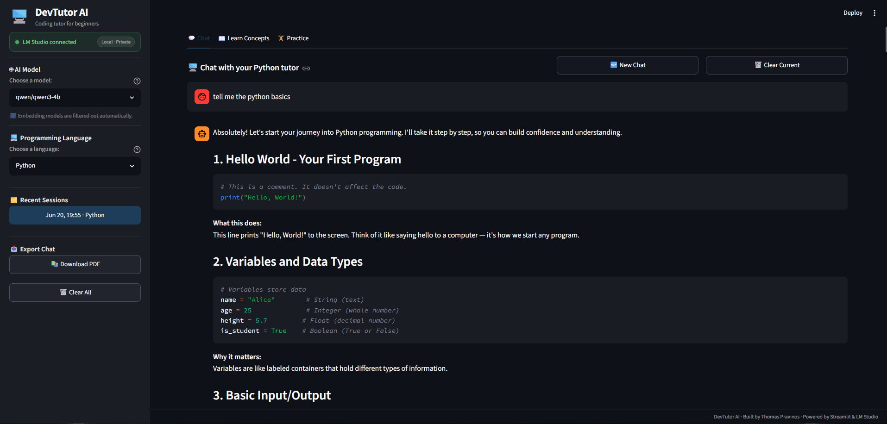

# Interactive Coding Tutor 🎓

A local AI-powered coding tutor that helps beginners learn programming fundamentals. Built with Streamlit and powered by LM Studio for completely private, local AI inference.



*Chat interface with Python selected*

## ✨ What This App Offers

### 🤖 **Intelligent Tutoring**
- **Chat Interface**: Ask programming questions in natural language and get personalized explanations with persistent chat history
- **Concept Explanations**: Get detailed explanations of programming concepts with examples
- **Practice Exercises**: Generate coding challenges and receive AI-powered feedback on your solutions

### 💻 **Multi-Language Support**
- Python, JavaScript, Java, C++, and C#
- Language-specific tutoring with appropriate syntax and best practices

### 🔒 **Privacy First**
- Completely local AI - no data sent to external servers
- Your code and conversations stay on your machine
- Works offline once set up

### 🎯 **Beginner Friendly**
- Designed for coding newcomers
- Simple explanations without overwhelming jargon
- Progressive learning approach

## 🚀 Setup and Installation

### Prerequisites
- **Python 3.11+** 
- **LM Studio** ([Download here](https://lmstudio.ai/))

### Step 1: Install LM Studio
1. Download and install LM Studio
2. Launch LM Studio and download a model through 'Discover' (recommended: **mistralai/mistral-7b-instruct-v0.3
Q4_K_M**)
3. Load the model and start the local server (http://localhost:1234)

### Step 2: Setup the Application
1. **Download** this project
2. **Create virtual environment**:
   ```bash
   python -m venv venv
   ```
   Activate it:
   - **Windows**: `venv\Scripts\activate`
   - **macOS / Linux**: `source venv/bin/activate`
3. **Install dependencies**:
   ```bash
   pip install -r requirements.txt
   ```

### Step 3: Run the Application
```bash
streamlit run src/ui/app.py
```

The app will open in your browser at http://localhost:8501

## 🎯 How to Use

### **💬 Chat Tab**
- Select your programming language from the sidebar
- Ask questions like:
  - "How do variables work in Python?"
  - "What's the difference between lists and arrays?"
  - "Can you help me understand loops?"
- Access previous chat sessions from the sidebar
- Export chat history as PDF for reference

### **📖 Learn Concepts Tab**  
- Choose a programming concept from the dropdown
- Get detailed explanations with examples
- Clear explanations when you're done

### **🏋️ Practice Tab**
- Select a topic to practice
- Generate coding exercises
- Submit your solutions for AI feedback
- Clear exercises to try new challenges

## ⚙️ Configuration

The app automatically detects your LM Studio setup. To customize settings, edit `config.yaml`:

```yaml
# LM Studio Configuration
llm_endpoint: "http://localhost:1234"

# Generation Settings
generation_settings:
  max_tokens: 2000
  temperature: 0.5
  timeout: 60
```

## 🔧 Troubleshooting

### LM Studio Issues
- **Connection Failed**: Ensure LM Studio is running with a model loaded
- **Slow Responses**: Try a smaller/quantized model
- **No Models**: Make sure you've downloaded and loaded a chat model (not embedding model)

### App Issues  
- **Import Errors**: Activate virtual environment and install requirements
- **Port Conflicts**: LM Studio uses port 1234, Streamlit uses 8501

## Contact

Built by Thomas Pravinos — tpravinos99@gmail.com or [GitHub](https://github.com/Pravinos).

Licensed under the [MIT License](LICENSE).